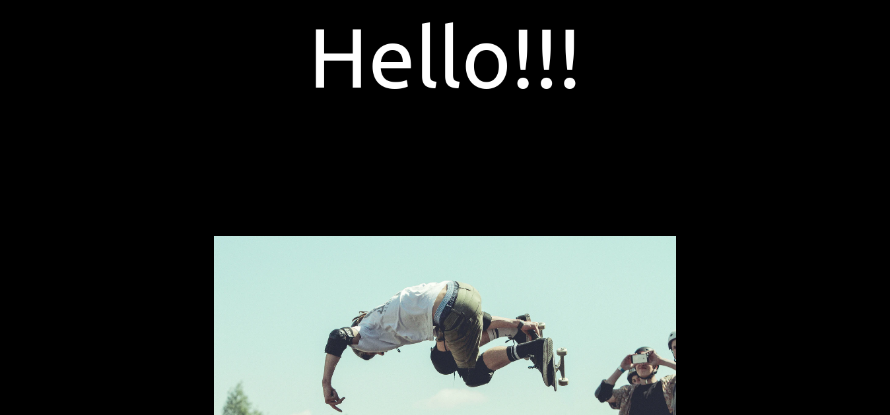

# Scrolling template.

This project was created with [Create React App](https://github.com/facebook/create-react-app) and it will be used as a template for future components.
It consists in a simple scroll animation with skew effects depending on the velocity of the scroll.

## Getting started

*   Click on the green button, in the repository. 
*   Add the following commands in your favorite bash:
```
git clone [copied text]
cd [repo name]
npm i
npm start
```

A tab will be opened in your default browser.

## Preview

<div align="center"></div>


### 🛠 Built With

*   React.js 
*   JSX
*   CSS
*   Netlify
*   ES6
*   npm
*   Hooks

<!-- CONTACT & SUPPORT -->
## Contact & Support

🙍 Guadalupe Rangel - kanemekanik@gmail.com - ☄

You liked it? ⭐️ Star the project!!!

Any comment that you want to send I'll be happy to receive it.

## Acknowledgments

[Jesper Landberg](https://jesperlandberg.dev/)

This project is for learning purposes. I don't own any image presented here.
